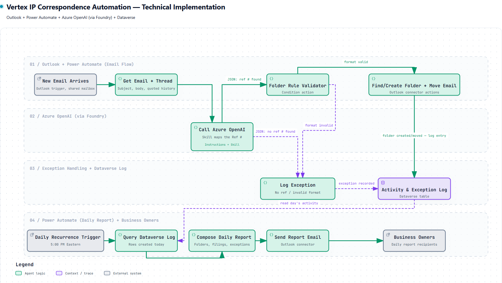

# Technical Design Document (TDD)
## Vertex IP Correspondence Automation Agent

| | |
|---|---|
| **Client** | Vertex Pharmaceuticals |
| **Project** | IP Correspondence Automation |
| **Solution Platform** | Microsoft Power Platform (Power Automate, Outlook, Dataverse) + Azure AI Foundry (Azure OpenAI) |
| **Document Type** | Technical Design Document (TDD) |
| **Companion Document** | Vertex IP FDD (Functional Design Document) — functional requirements, business rules, exception handling |
| **Version** | 1.0 Draft |
| **Prepared By** | Hai Nguyen |
| **Date** | October 2026 |

---

## Table of Contents

1. [Document Purpose](#1-document-purpose)
2. [Solution Architecture](#2-solution-architecture)
3. [Agent Design — Azure OpenAI (via Azure AI Foundry)](#3-agent-design--azure-openai-via-azure-ai-foundry)
4. [Folder Rule Validator (Power Automate)](#4-folder-rule-validator-power-automate)
5. [Dataverse Schema](#5-dataverse-schema)
6. [Implementation Recommendations](#6-implementation-recommendations)
7. [Non-Functional Considerations](#7-non-functional-considerations)

---

## 1. Document Purpose

This Technical Design Document (TDD) defines how the functional requirements in the Vertex IP FDD are implemented technically, using Outlook, Power Automate, Azure OpenAI (via Azure AI Foundry), and Dataverse. It is the technical companion to the FDD and is intended for the build/delivery team and technical reviewers.

## 2. Solution Architecture

Phase 1 is implemented using four coordinated components, shown below:



*Diagram source: `.archify\workflow-vertex-technical-implementation-20261008-092901\vertex-technical-implementation.html` (interactive version).*

1. **Outlook + Power Automate (email flow)** — a "When a new email arrives (V3)" trigger scoped to the shared mailbox retrieves the email and thread (subject, body, quoted history).
2. **Azure OpenAI (via Azure AI Foundry)** — Power Automate calls the model with an **Instructions + Skill** configuration (see §3). The call always returns **structured JSON only** — the model performs no agent-side decisioning.
3. **Folder Rule Validator (deterministic, in Power Automate)** — Power Automate parses the JSON (Parse JSON action) and evaluates the Folder Rule as a **Condition/Switch action**, not a model call (see §4). Valid references are routed to folder filing; invalid or missing references are routed to the exception path.
4. **Dataverse (activity + exception log)** — every filing and exception event is written to a single Dataverse table (see §5), which a second, independent Power Automate flow queries on a daily recurrence to compose and send the daily report to business owners.

Keeping the real-time filing flow and the daily report flow independent means real-time filing is never blocked waiting on the daily report.

## 3. Agent Design — Azure OpenAI (via Azure AI Foundry)

The agent is configured as a prompt agent with two distinct components plus a fixed output contract:

- **Instructions** — the system prompt encodes Ref # lead-in phrases ("Client Reference:", "Your Ref", "Your Reference:", "Your Ref No", etc.) and the known matter prefixes (VPI, ALP, EXO, MOD, SEM, VIA, VMN).
- **Skill** — a trainable, extensible component that identifies the Ref # in the title/body and maps known prefixes/aliases to the right matter. As the business supplies new mapping rules, the skill can be retrained/extended **without rewriting the core instructions**. This is the mechanism for keeping pace with new matter prefixes over time.
- **Output (structured JSON only)** — the call always returns a fixed JSON contract and performs no agent-side decisioning:

  ```json
  {
    "reference": "SEM-26-788",
    "is_vertex": false,
    "segments": 3,
    "normalized_value": "SEM-26-788",
    "confidence": 0.97
  }
  ```

Power Automate parses this JSON (Parse JSON action) and branches on `reference` / `is_vertex`:
- **JSON: ref # found** → proceed to Folder Rule Validator (§4)
- **JSON: no ref # found** → log exception (no reference found — see FDD §10 Exception 1)

## 4. Folder Rule Validator (Power Automate)

Implemented as a **Condition/Switch action** in the flow — a deterministic rule, not a model call:

| Reference type | Rule | Example |
|---|---|---|
| Vertex reference | Exactly 2 segments | `00-113`, `00-128` |
| Non-Vertex reference | Prefix + 2 segments | `SEM-24-783`, `SEM-25-786` |

- Country-code suffixes are stripped before validation (e.g., `VPI-18-114 US PRV1` → `VPI-18-114`).
- **format valid** → Find/Create Folder + Move Email (Outlook connector actions) → log entry in Dataverse.
- **format invalid** → Log Exception (Exception Type: Invalid Format) in Dataverse; email is left untouched in the Inbox (see FDD §10 Exception 5).

## 5. Dataverse Schema

One table — **Activity & Exception Log**:

| Field | Description |
|---|---|
| Message ID | Unique identifier of the source email, assigned by the mail system |
| Sender | Email address of the message sender |
| Subject | Original email subject line, unmodified |
| Reference | Normalized matter/family reference detected; blank if none found |
| Folder | Destination family folder the email was filed to, or matched against |
| Result | Filed / Created Folder and Filed / Exception |
| Timestamp (UTC) | Date and time the email was processed |
| Exception Type | Populated only when Result = Exception (e.g., No Reference Found, Multiple References, Invalid Format) |

- Index on **Timestamp + Result** for fast daily queries by the report flow.

## 6. Implementation Recommendations

- Check Dataverse for an existing **Message ID** before filing, to make retries idempotent.
- Wrap Outlook actions in a **Scope** with "configure run after" to catch failures as exceptions.
- Keep the two flows independent: real-time filing never waits on the daily report.

## 7. Non-Functional Considerations

- **Performance** — process emails within minutes of receipt.
- **Accuracy** — target >95% filing accuracy.
- **Security** — operate within the Vertex-approved Microsoft 365 / Azure environment.
- **Auditability** — every action logged to Dataverse.
- **Scalability** — support additional IP teams and family/matter types without redesign (new prefixes handled by retraining the Skill, per §3).

---

This TDD should be read alongside the Vertex IP FDD, which defines the complete functional requirements (FR-1 through FR-9), business rules, and exception handling this technical design implements.
